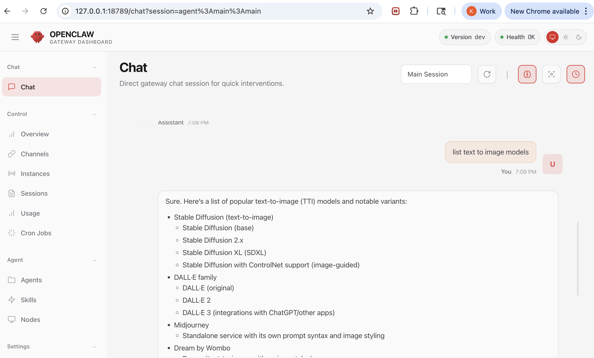
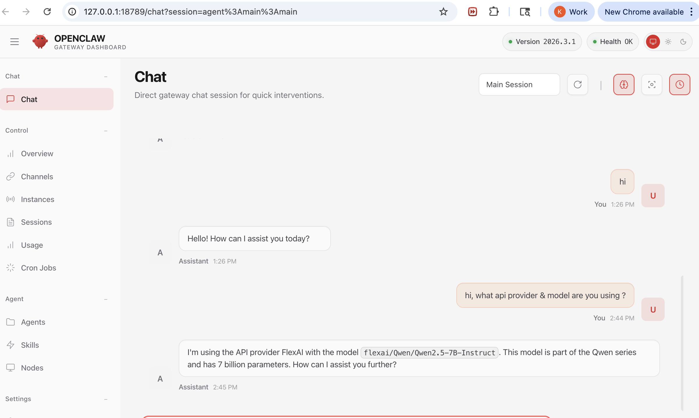
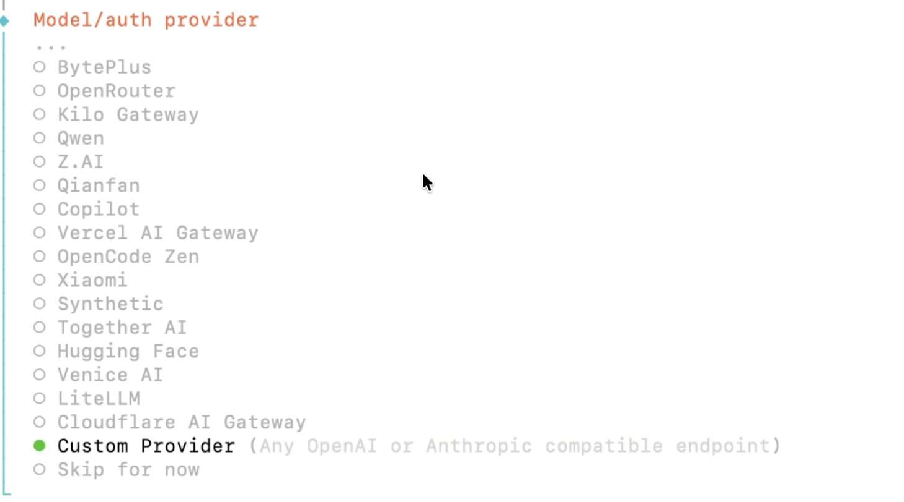

# OpenClaw + FlexAI — Setup Guide

This directory contains the OpenClaw configuration for the **GTC 2026** demo environment,
wired to a FlexAI inference endpoint running **Qwen 2.5 7B**.

> **Reference docs:** https://docs.openclaw.ai/

---

## Demo screenshots

### 1. OpenRouter — chat working with free models

> Proof of concept using OpenRouter as the API provider (free-tier models, no paid Anthropic/OpenAI key needed).



---

### 2. FlexAI — OpenClaw confirmed using FlexAI as inference provider

> The agent explicitly confirms it is using `flexai/Qwen/Qwen2.5-7B-Instruct` as the model.



---

### 3. How to configure FlexAI — select "Custom Provider" in the wizard

> During `openclaw onboard`, scroll to the bottom of the provider list and select **Custom Provider** (any OpenAI-compatible endpoint). Then paste the FlexAI inference URL and API key.



---

## Prerequisites

| Requirement | Version |
|---|---|
| Node.js | 22 or newer (`node --version`) |
| npm | bundled with Node 22 |
| FlexAI API key | `flex_…` — see your FlexAI platform dashboard |
| FlexAI inference endpoint | `https://inference-<id>.platform.flex.ai/v1` |

---

## 1 — Install OpenClaw

```bash
# macOS / Linux (recommended)
curl -fsSL https://openclaw.ai/install.sh | bash

# or via npm
npm install -g openclaw@latest
```

Verify the install:

```bash
openclaw --version
```

---

## 2 — Set environment variables

Create a `.env` file from the provided template:

```bash
cp .env.example .env
```

Open `.env` and fill in your FlexAI values:

```dotenv
# FlexAI inference endpoint — from your FlexAI platform dashboard
FLEXAI_BASE_URL=https://inference-<id>.platform.flex.ai/v1

# FlexAI API key
FLEXAI_API_KEY=flex_xxxxxxxxxxxxxxxxxxxxxxxxxxxx
```

> **Security:** `.env` is listed in `.gitignore` and must never be committed.
> The config files in `agents/*/agent/models.json` and `auth-profiles.json`
> reference these variables via `${FLEXAI_BASE_URL}` and `${FLEXAI_API_KEY}`.

OpenClaw automatically loads `.env` from `~/.openclaw/` as a global fallback,
or from the current working directory. See
[Environment docs](https://docs.openclaw.ai/help/environment) for full precedence rules.

---

## 3 — Copy config into `~/.openclaw`

OpenClaw reads its config from `~/.openclaw/openclaw.json`. Copy this repo's
config to that location:

```bash
# First time — copy everything
cp -r . ~/.openclaw/

# Or symlink (changes here instantly reflect in the running gateway)
ln -sfn "$(pwd)/openclaw.json" ~/.openclaw/openclaw.json
```

> If `~/.openclaw/` already exists, review existing files before overwriting.

---

## 4 — Run the onboarding wizard

The wizard configures auth, workspace, gateway settings, and optionally channels:

```bash
openclaw onboard --install-daemon
```

What it sets up:

| Step | What happens |
|---|---|
| **Model / Auth** | Validates the FlexAI API key and endpoint |
| **Workspace** | Points the agent at `~/.openclaw/workspace` (bootstrap files seeded automatically) |
| **Gateway** | Port 18789, loopback, auto-generated auth token |
| **Channels** | WhatsApp / Telegram / Discord — optional, skip if only using Control UI |
| **Daemon** | Installs a LaunchAgent (macOS) or systemd unit (Linux) so the gateway starts on login |

To reconfigure later without a full reset:

```bash
openclaw configure
```

---

## 5 — Start the Gateway

If the daemon was installed, it starts automatically. To verify:

```bash
openclaw gateway status
```

To start manually in the foreground (useful for debugging):

```bash
openclaw gateway --port 18789
```

---

## 6 — Open the Control UI

```bash
openclaw dashboard
```

Or navigate directly to: **http://127.0.0.1:18789/**

---

## 7 — Verify models & agents

This repo configures two agents:

| Agent | Directory | Model |
|---|---|---|
| `main` | `agents/main/` | `flexai/Qwen/Qwen2.5-7B-Instruct` |
| `chatbot` | `agents/chatbot/` | `flexai/Qwen/Qwen2.5-7B-Instruct` |

A local Ollama model (`llama3.2:latest` on port `11434`) is also registered in the
`main` agent as a fallback. Start Ollama separately if you need it:

```bash
ollama serve
ollama pull llama3.2:latest
```

To list registered models from the CLI:

```bash
openclaw agents list
```

---

## 8 — Config hot reload

The Gateway watches `~/.openclaw/openclaw.json` and applies changes automatically.
Most fields (agents, models, channels, automation) hot-apply with no restart.
Gateway-level changes (port, TLS) require a restart.

Reload modes (set in `openclaw.json`):

| Mode | Behavior |
|---|---|
| `hybrid` *(default)* | Hot-applies safe changes; auto-restarts for critical ones |
| `hot` | Hot-applies only; logs a warning when a restart is needed |
| `restart` | Restarts on any change |
| `off` | Manual restarts only |

---

## 9 — Validate config

```bash
openclaw doctor
```

If issues are found:

```bash
openclaw doctor --fix
```

---

## 10 — View logs

```bash
openclaw logs
```

---

## File structure

```
.openclaw/
├── openclaw.json            # Main gateway config (JSON5)
├── .env.example             # Copy to .env and fill in secrets
├── .gitignore               # Excludes credentials, sessions, logs
├── agents/
│   ├── main/agent/
│   │   ├── models.json      # FlexAI + Ollama providers (uses ${FLEXAI_*} env vars)
│   │   └── auth-profiles.json
│   └── chatbot/agent/
│       ├── models.json      # FlexAI provider (uses ${FLEXAI_*} env vars)
│       └── auth-profiles.json
├── workspace/               # Agent workspace files (AGENTS.md, SOUL.md, etc.)
└── workspace-chatbot/       # Chatbot agent workspace files
```

---

## Useful commands

```bash
openclaw --help              # Full CLI reference
openclaw gateway status      # Check if the gateway is running
openclaw gateway restart     # Restart the gateway
openclaw agents list         # List configured agents
openclaw channels status     # Check connected channels
openclaw sessions list       # List active sessions
openclaw logs --follow       # Tail the gateway log
```

---

## Further reading

| Topic | Link |
|---|---|
| Full configuration reference | https://docs.openclaw.ai/gateway/configuration-reference |
| Configuration examples | https://docs.openclaw.ai/gateway/configuration-examples |
| Multi-agent routing | https://docs.openclaw.ai/concepts/multi-agent |
| Channel setup | https://docs.openclaw.ai/channels |
| Environment variables | https://docs.openclaw.ai/help/environment |
| Security | https://docs.openclaw.ai/gateway/security |
| Troubleshooting | https://docs.openclaw.ai/gateway/troubleshooting |

---

## Team notes — GTC demo decisions & known issues

> Context for internal team reviewing this setup before the GTC 2026 demo.

### Alternative API providers

Before landing on FlexAI, **OpenRouter** was evaluated as an alternative to paid
Anthropic/OpenAI models. OpenRouter provides access to a number of free-tier models
([openrouter.ai/models](https://openrouter.ai/models)) with API keys at
[openrouter.ai/settings/keys](https://openrouter.ai/settings/keys).

OpenClaw worked with OpenRouter successfully (chat tested and confirmed). However,
**FlexAI is more compelling for the GTC demo** because it showcases our own inference
platform rather than a third-party relay.

### Why FlexAI works as a custom provider

FlexAI's inference API is **OpenAI-compatible**. In OpenClaw's onboarding wizard, choose
**Custom Provider** (the last option in the provider list — see `openclaw onboard`), then paste in:

- **Base URL:** your FlexAI inference job endpoint (`https://inference-<id>.platform.flex.ai/v1`)
- **API Key:** your `flex_…` key

This is exactly what the `agents/*/agent/models.json` files in this repo are pre-configured to do.

### Broader platform strategy

Even if we build additional demo flows using Google Vertex AI or Microsoft Copilot
agentic builders, **those should also be configured to call FlexAI** for inference — keeping
FlexAI as the unified GPU backend across all demo touchpoints at GTC.

### ⚠️ Known issue: response latency with FlexAI via OpenClaw

Response times through OpenClaw → FlexAI are **noticeably slower** compared to chatting
directly via Chainlit on `console.flex.ai`. Simple prompts have been observed taking
**30+ seconds** in some cases. This does not occur when using other providers (e.g.
OpenRouter).

Likely causes: network hops between OpenClaw Gateway → FlexAI inference endpoint,
plus potential platform-level constraints on the active inference job.

**Recommended mitigations before the live demo:**

| Mitigation | Details |
|---|---|
| Backup flow via Chainlit | Have `console.flex.ai` signed in and ready as a fallback |
| Pre-tested prompts | Run a set of rehearsed prompts ahead of the demo and note response times |
| Local Ollama fallback | `llama3.2:latest` is already configured in the `main` agent — start `ollama serve` as a warm fallback |
| Network check | Run demo on a known-good wired network, not conference Wi-Fi |

### OpenClaw capabilities worth exploring beyond API routing

There is more to OpenClaw than using it as an OpenAI-compatible gateway. Capabilities
from [docs.openclaw.ai/concepts/features](https://docs.openclaw.ai/concepts/features)
worth demoing or prototyping:

| Capability | GTC demo angle |
|---|---|
| **WhatsApp / Telegram / Discord channels** | Demo a fleet operator messaging an AI agent from their phone to query GPU cluster status |
| **Multi-agent routing** | Route workload-specific queries to specialist agents (e.g. infra agent vs. billing agent) |
| **iOS / Android mobile nodes** | Live device demo — photograph a dashboard and have the agent analyse it |
| **Media support (images, audio, documents)** | Upload a GPU utilisation graph; agent interprets and recommends optimisations |
| **Cron jobs & webhooks** | Scheduled agent check-ins (heartbeat) — e.g. daily GPU cost summary pushed to Telegram |
| **Web Control UI** | No extra setup needed — already running at `http://127.0.0.1:18789/` |
| **Skills / tools** | Extend the agent with custom skill packs (`openclaw agents add`) for FlexAI-specific workflows |

